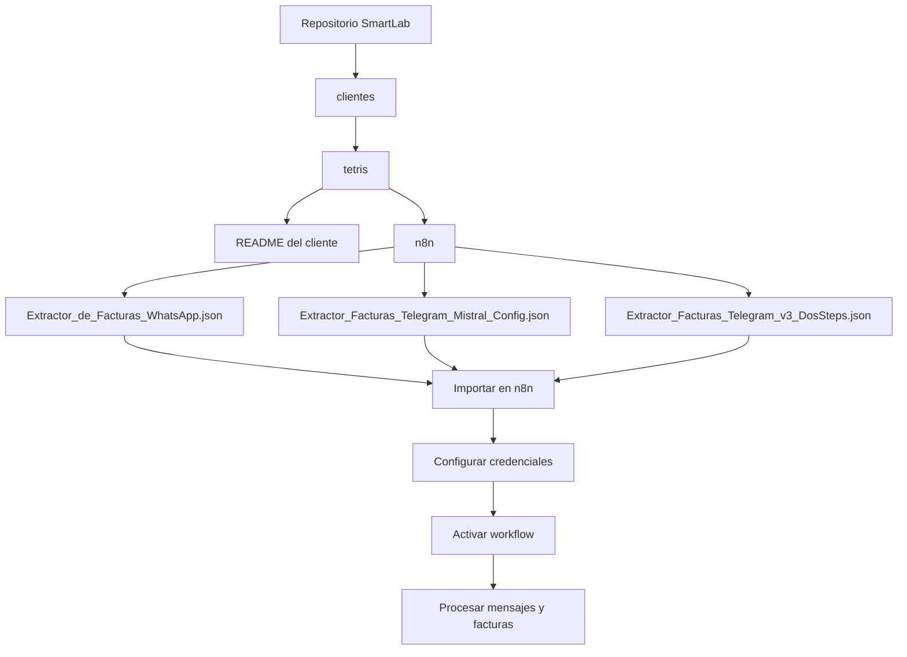
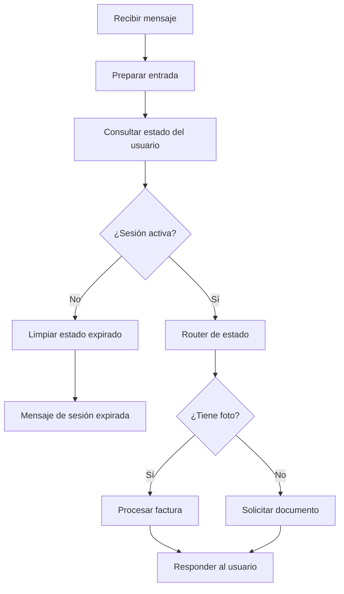
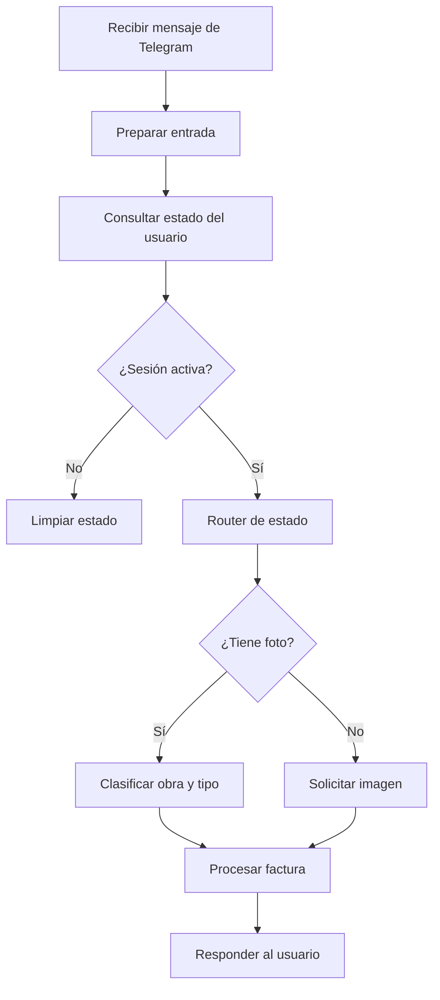

# Cliente Tetris

Esta carpeta reúne los flujos de n8n del cliente Tetris relacionados con la extracción de facturas desde WhatsApp y Telegram.

## Archivos incluidos

- [n8n/Extractor_de_Facturas_WhatsApp.json](n8n/Extractor_de_Facturas_WhatsApp.json): flujo para recibir mensajes por WhatsApp, validar sesión y completar el procesamiento de la factura.
- [n8n/Extractor_Facturas_Telegram_Mistral_Config.json](n8n/Extractor_Facturas_Telegram_Mistral_Config.json): flujo para Telegram con integración de Mistral y configuración configurable.
- [n8n/Extractor_Facturas_Telegram_v3_DosSteps.json](n8n/Extractor_Facturas_Telegram_v3_DosSteps.json): flujo para Telegram con un proceso en dos pasos basado en obra y tipo.

## Estructura recomendada para que funcione

Para que el cliente quede ordenado y los flujos sean fáciles de importar en n8n, la estructura debe seguir este patrón:

```text
clientes/
  tetris/
    README.md
    n8n/
      Extractor_de_Facturas_WhatsApp.json
      Extractor_Facturas_Telegram_Mistral_Config.json
      Extractor_Facturas_Telegram_v3_DosSteps.json
```

### Reglas de nombres y organización

- La carpeta del cliente debe tener el nombre del cliente, por ejemplo `tetris`.
- Dentro de cada cliente debe existir siempre una carpeta llamada `n8n`.
- Los archivos JSON deben quedar dentro de `n8n/` y conservar nombres claros y consistentes.
- Si se agregan nuevas versiones, conviene mantener un patrón similar: `<tipo>_<canal>_<version>.json`.
- El README del cliente debe reflejar la ubicación y el propósito de cada workflow.

### Configuración mínima para usar los flujos

1. Importar cada JSON en n8n como un workflow nuevo.
2. Verificar que las credenciales necesarias estén activas antes de activar el workflow.
3. Mantener los nombres de credenciales y nodos coherentes con lo que espera el flujo.
4. Activar el workflow solo cuando las conexiones externas estén listas.
5. Si se mueve un JSON a otra carpeta o se cambia el nombre, actualizar esa referencia en el README y en la organización del repositorio.

## Diagrama de estructura y uso



## Diagramas conceptuales

### Flujo general de WhatsApp



### Flujo general de Telegram



Estos diagramas son una vista conceptual de la lógica de cada flujo y pueden ajustarse a medida que se agreguen nuevas versiones.
