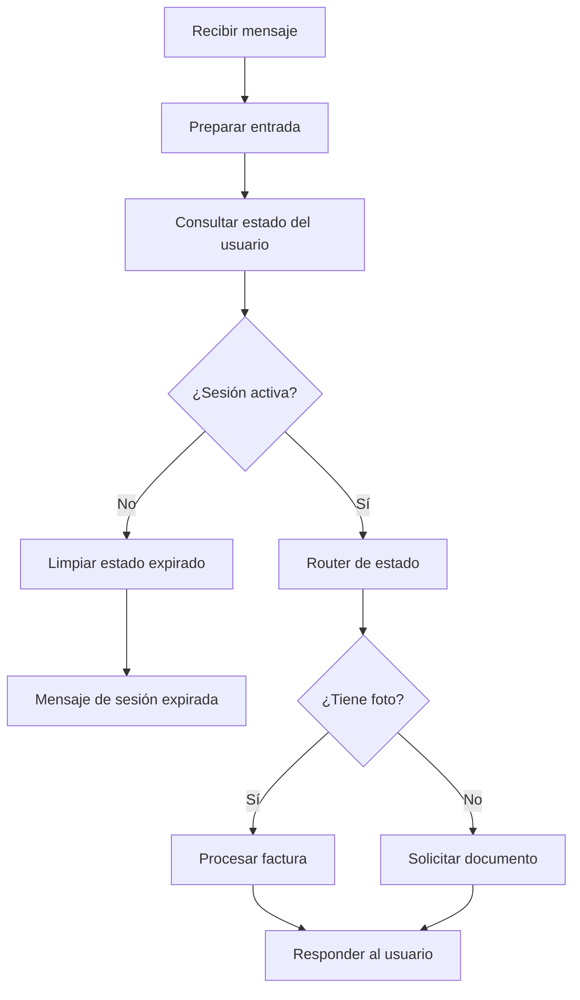
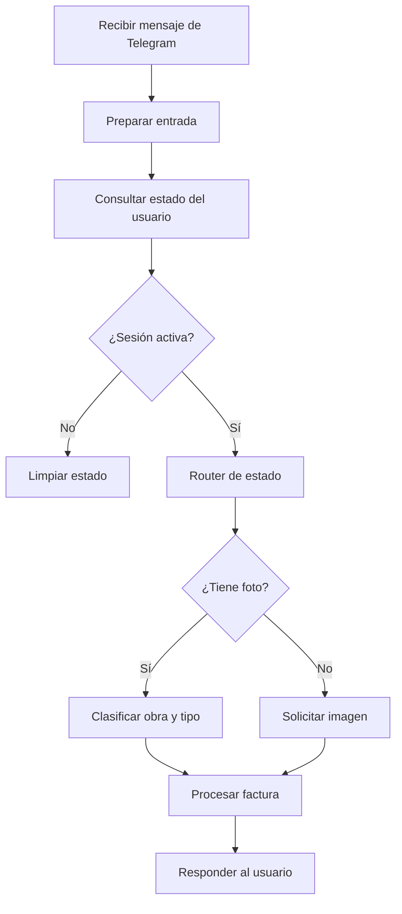

# Cliente Tetris

Esta carpeta reúne los flujos de n8n del cliente Tetris relacionados con la extracción de facturas desde WhatsApp y Telegram.

## Archivos incluidos

- `Extractor_de_Facturas_WhatsApp.json`: flujo para recibir mensajes por WhatsApp, validar sesión y completar el procesamiento de la factura.
- `Extractor_Facturas_Telegram_Mistral_Config.json`: flujo para Telegram con integración de Mistral y configuración configurable.
- `Extractor_Facturas_Telegram_v3_DosSteps.json`: flujo para Telegram con un proceso en dos pasos basado en obra y tipo.

## Diagramas conceptuales

### Flujo general de WhatsApp

### Flujo general de Telegram

Estos diagramas son una vista conceptual de la lógica de cada flujo y pueden ajustarse a medida que se agreguen nuevas versiones.
