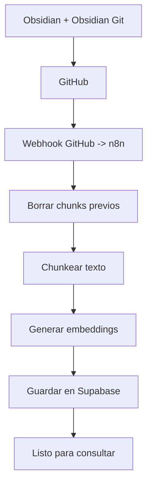
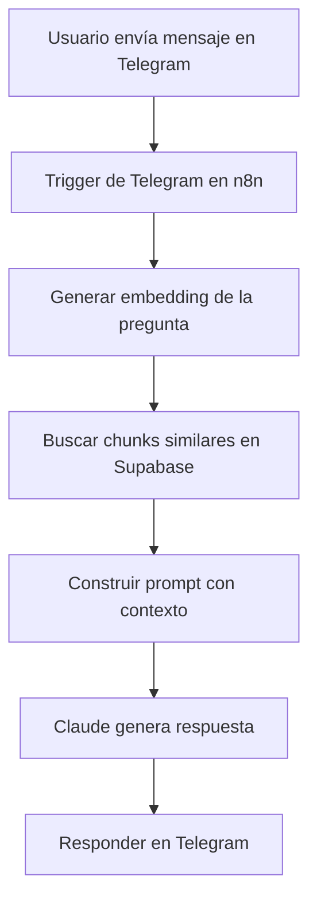

# Evolutivo RAG

Este directorio reúne la documentación y los workflows de n8n del proyecto RAG para la Vault de conocimiento.

## Archivos del proyecto

- [RAG_Documentacion_Por_Que.md](RAG_Documentacion_Por_Que.md): explicación del porqué de cada paso del flujo.
- [RAG_Vault_Telegram_Setup.md](RAG_Vault_Telegram_Setup.md): guía de configuración para Telegram y dependencias.
- [RAG_Workflow1_Indexacion.json](RAG_Workflow1_Indexacion.json): workflow de indexación desde GitHub hacia Supabase.
- [RAG_Workflow2_Telegram.json](RAG_Workflow2_Telegram.json): workflow de consulta desde Telegram hacia el modelo y la base vectorial.

## Estructura de carpetas

```text
evolutivos/
  rag/
    README.md
    RAG_Documentacion_Por_Que.md
    RAG_Vault_Telegram_Setup.md
    RAG_Workflow1_Indexacion.json
    RAG_Workflow2_Telegram.json
```

## Flujo 1: indexación de documentos



## Flujo 2: consulta por Telegram



## Resumen simple

1. Los cambios en la Vault se suben a GitHub.
2. GitHub notifica a n8n.
3. n8n indexa el contenido en Supabase con embeddings.
4. Cuando alguien consulta por Telegram, n8n recupera contexto relevante y responde con ayuda del modelo.

## Notas operativas

- Mantener los nombres de los workflows y los archivos consistentes.
- Revisar credenciales y conexiones antes de activar los workflows.
- Si cambian los archivos de la Vault, la indexación debe volver a correr para actualizar los chunks.
